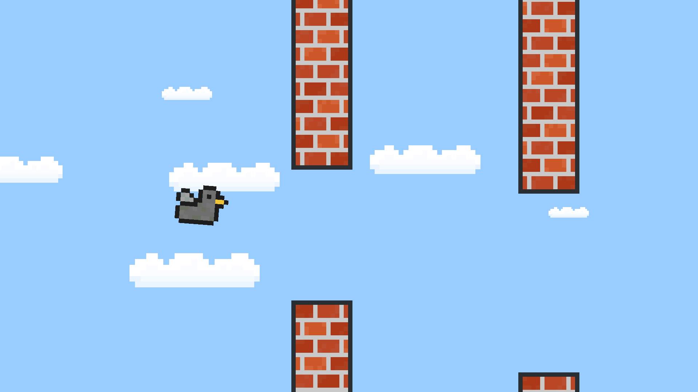

# FlappyPigeon
C++ flappy bird project to practice scene classes, main loops, and OpenGL

Build with CMake:
```
cd FlappyPigeon/  
cmake -S . -B build  
cmake --build build/  
```
Executable will be in FlappyPigeon/build/  

<br>
<br>
<br>
<br>
<br>
<br>
  


